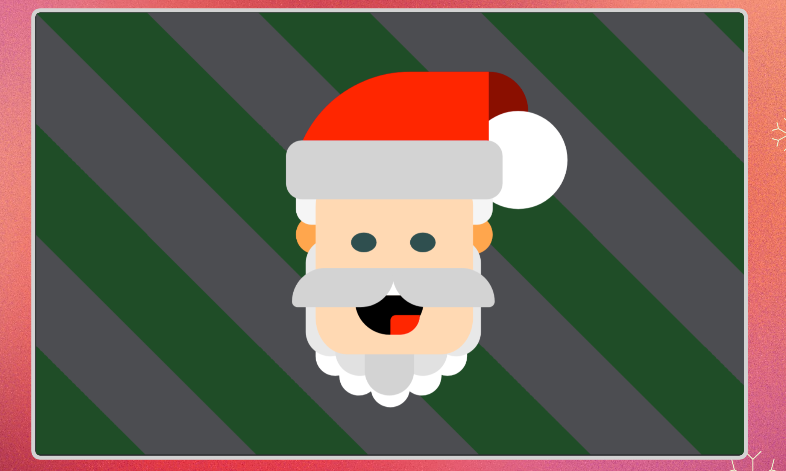

1. Start by adding two divs inside main: one for the background, and the other for Santa's face.

2. For the background, start by setting the width to 360px and the height to 225px.

3. For the background pattern, use background-image and the CSS linear-gradient function. Learn more here:

- Scrimba: <https://v2.scrimba.com/the-frontend-developer-career-path-c0j/~0pk>
- MDN: <https://developer.mozilla.org/en-US/docs/Web/CSS/gradient/linear-gradient>

4. Use z-index to place the background in the back and Santa's face on top. Learn more here:

- Scrimba: <https://v2.scrimba.com/the-frontend-developer-career-path-c0j/~0db>
- MDN: <https://developer.mozilla.org/en-US/docs/Web/CSS/z-index>

5. Use positioning to draw Santa's face. Use a combination of position: relative and position: absolute. Learn more here:

- Scrimba: <https://v2.scrimba.com/the-frontend-developer-career-path-c0j/~0d5>
- MDN: <https://developer.mozilla.org/en-US/docs/Learn/CSS/CSS_layout/Positioning>

6. For the rounded corners and circles, make heavy use of border-radius. Learn more here:

- Scrimba: <https://v2.scrimba.com/the-frontend-developer-career-path-c0j/~01j>
- MDN: <https://developer.mozilla.org/en-US/docs/Web/CSS/border-radius>

/\*
color code

- background: #1E4E27 #4C4D51
- santa cap:#FF2700 #8A0F00 #FFFFFF #D3D3D3 #F5F5F5
- face: #FFD9B3
- ear: #FFA64D
- eys: #2F4F4F
- mouth: #000 #FF2700
- beard: #D3D3D3 #FFFFFF
  \*/
